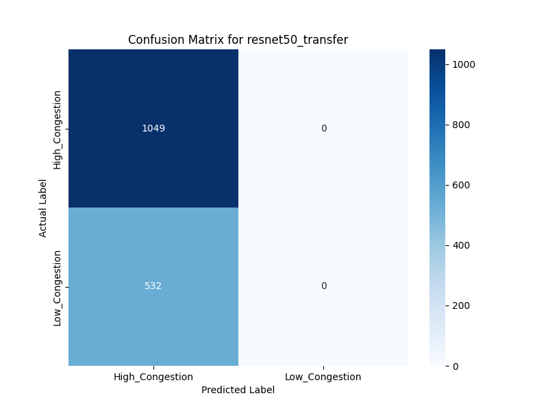

# 🚦 Monitoring Traffic Congestion in Smart Cities Using CNN

<div align="center">


[](https://opensource.org/licenses/MIT)
[](https://www.python.org/downloads/)
[](https://www.tensorflow.org/)
[](http://commonmark.org)
[](https://github.com/Sairam-kattunga/Traffic_Congestion_Monitoring_CNN/stargazers)

</div>

---

## 📌 Overview

This project offers a **deep learning-based solution** for **real-time traffic congestion analysis**.  
Using **Convolutional Neural Networks (CNNs)**, the system classifies road images into **High Congestion** and **Low Congestion** categories.

We compare a **custom CNN** against **transfer learning** models — *VGG16, ResNet50, and MobileNetV2* — to find the most accurate architecture.

---

## 🌟 Key Features

- 📷 **High-Accuracy Classification** — Detects congestion states from static images.
- 🔍 **Comparative Model Analysis** — Evaluates 4 CNN architectures.
- ♻ **Transfer Learning** — Uses pre-trained models for better performance.
- 🖼 **Data Augmentation** — Improves robustness and prevents overfitting.
- 🧩 **Modular Codebase** — Clean scripts for reproducibility.

---

## 📊 Results Sneak-Peek

**🏆 Best Model:** `ResNet50 (Transfer Learning)` → **~99% Accuracy**



| Model                 | Accuracy | Notes |
| --------------------- | :------: | ----- |
| Custom CNN            |  89%     | Baseline model |
| VGG16 (Transfer)      |  96%     | Significant improvement |
| MobileNetV2 (Transfer)|  98%     | High efficiency |
| **ResNet50 (Transfer)** | **99%** | Best performer |

---

## 🛠 Project Workflow

1. **Data Preprocessing** → Organize and augment dataset.
2. **Model Training** → Train custom CNN and transfer learning models.
3. **Evaluation** → Generate accuracy reports & confusion matrices.
4. **Comparison** → Select best-performing model.

---

## 📂 Repository Structure

```

traffic\_congestion\_project/
├── dataset/                # Image dataset
│   ├── High\_Congestion/
│   └── Low\_Congestion/
├── models/                 # Trained .keras models
├── results/                # Evaluation outputs
├── scripts/                # Python scripts
│   ├── preprocess\_data.py
│   ├── train\_cnn.py
│   ├── train\_transfer.py
│   └── evaluate.py
├── README.md
└── requirements.txt

````

---

## ⚙ Getting Started

### 1️⃣ Dataset Setup
- Download from Kaggle: [Traffic Management - Image Dataset](https://www.kaggle.com/datasets/satyampd/traffic-management-image-dataset)
- Create folders:  
  `dataset/High_Congestion/` and `dataset/Low_Congestion/`
- Move:
  - Dense traffic images → **High_Congestion**
  - Sparse traffic images → **Low_Congestion**

### 2️⃣ Installation
```bash
# Clone the repo
git clone https://github.com/Sairam-kattunga/Traffic_Congestion_Monitoring_CNN.git
cd Traffic_Congestion_Monitoring_CNN

# Install dependencies
pip install -r requirements.txt
````

### 3️⃣ Training Models

```bash
cd scripts

# Custom CNN
python train_cnn.py

# Transfer Learning
python train_transfer.py --model vgg16
python train_transfer.py --model resnet50
python train_transfer.py --model mobilenet
```

### 4️⃣ Evaluation

```bash
python evaluate.py
```

---

## 💡 Future Enhancements

* 🎥 **Real-time Video Processing** using OpenCV
* 🌐 **Web App Deployment** (Flask / Streamlit)
* 🚗 **Multi-Class Detection** (accident, roadwork, fire, etc.)
* 🎯 **Hyperparameter Optimization** with Optuna / KerasTuner

---

## 📜 License

Distributed under the MIT License. See `LICENSE` for details.

---

## 📧 Contact

**Rama Venkata Manikanta Sairam Kattunga**
🌐 [Portfolio](https://simple-portfolio-sigma-orpin.vercel.app/)
📩 [sairamkattunga333@gmail.com](mailto:sairamkattunga333@gmail.com)
📂 [GitHub Repo](https://github.com/Sairam-kattunga/Traffic_Congestion_Monitoring_CNN)
